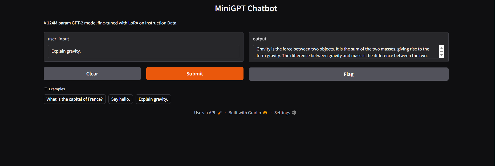

# MiniGPT: End-to-End LLM Implementation & Fine-Tuning

## Project Overview

**MiniGPT** is a high-performance implementation of the **GPT-2 (124M)** architecture built entirely from scratch in PyTorch. Unlike standard implementations that rely on high-level APIs (like HuggingFace `AutoModel`), this project manually implements the core mathematics of the Transformer architecture to demonstrate deep understanding of **Generative AI**, **NLP Pipelines**, and **Model Optimization**.

Beyond architecture, this project implements **LoRA (Low-Rank Adaptation)** from scratch without external libraries, enabling parameter-efficient fine-tuning on consumer hardware.

### Key Objectives Achieved

- **Deep Learning Architecture:** Implemented Causal Multi-Head Attention, Feed-Forward Networks, and Layer Normalization manually.
- **Inference Optimization:** Implemented **KV Caching** to reduce inference time complexity from $O(N^2)$ to $O(N)$.
- **Parameter Efficient Fine-Tuning (PEFT):** Built a custom LoRA adapter to fine-tune the model on instruction data, reducing trainable parameters by **99.8%**.
- **Transfer Learning:** Successfully bridged the gap between custom architecture and official OpenAI weights.

---

## Technical Stack & Skills

| Category             | Technologies & Concepts                                                       |
| :------------------- | :---------------------------------------------------------------------------- |
| **Core Framework**   | Python, PyTorch (nn.Module, autograd), NumPy                                  |
| **LLM Architecture** | Transformer Decoder, Positional Embeddings, Causal Masking, Softmax Attention |
| **Optimization**     | **KV Caching**, Weight Tying, Gradient Checkpointing                          |
| **Fine-Tuning**      | **LoRA (Low-Rank Adaptation)**, Supervised Fine-Tuning (SFT)                  |
| **NLP Pipeline**     | **BPE Tokenization** (TikToken), Data Loading, Dynamic Batching               |
| **Deployment**       | Gradio (Web UI), CUDA Acceleration                                            |

---

## Core Features Implementation

### 1. The "From Scratch" Transformer

Built a modular `GPTLanguageModel` class mirroring the GPT-2 Small architecture (124M parameters).

- **Attention Mechanism:** Manual implementation of `Q @ K^T / sqrt(d_k)` with causal masking logic.
- **Weight Loading:** Custom script to map and load official OpenAI weights into local tensor shapes.

### 2. Low-Rank Adaptation (LoRA)

Instead of fine-tuning all 124M parameters, I injected rank-decomposition matrices into the Attention layers.

- **Math:** $W_{new} = W_{frozen} + (A \times B)$
- **Efficiency:** Reduced trainable parameters from **124,000,000** to **~294,000** (0.18% of total).
- **Result:** Enabled fine-tuning on the Alpaca Instruction dataset using a single consumer GPU.

### 3. KV Caching for Inference

Implemented a caching mechanism to store Key and Value states during generation. This prevents redundant re-computation of previous tokens, drastically speeding up text generation for long sequences.

---

## Performance & Results

- **Base Model Performance:** Successfully reproduced GPT-2 text generation capabilities (coherent English, grammar, syntax).
- **Fine-Tuning Results:**
  - **Dataset:** Alpaca Instruct (Subset)
  - **Start Loss:** ~2.81
  - **End Loss:** ~2.19
  - **Outcome:** The model successfully shifted from "Document Completion" behavior to "Chat Assistant" behavior (User/Assistant format).

**Engineering Insight:**
_Observed trade-off between alignment and knowledge retention: While 1,000-sample fine-tuning successfully taught the model the instruction format (greetings, explanations), factual recall on specific entities (e.g., "Capital of France") required access to frozen weights via the adapter, highlighting the importance of larger-scale fine-tuning for knowledge-heavy tasks._

---

## Visualization

\_

---

## How to Run

1. **Clone the repository**

   ```bash
   git clone https://github.com/yourusername/minigpt.git
   cd minigpt
   ```

2. **Install Dependencies**

   ```bash
   pip install torch tiktoken gradio
   ```

3. **Run the Chatbot**

   ```bash
   python app.py
   ```

_This will launch a local web server at `http://127.0.0.1:7860`_.
